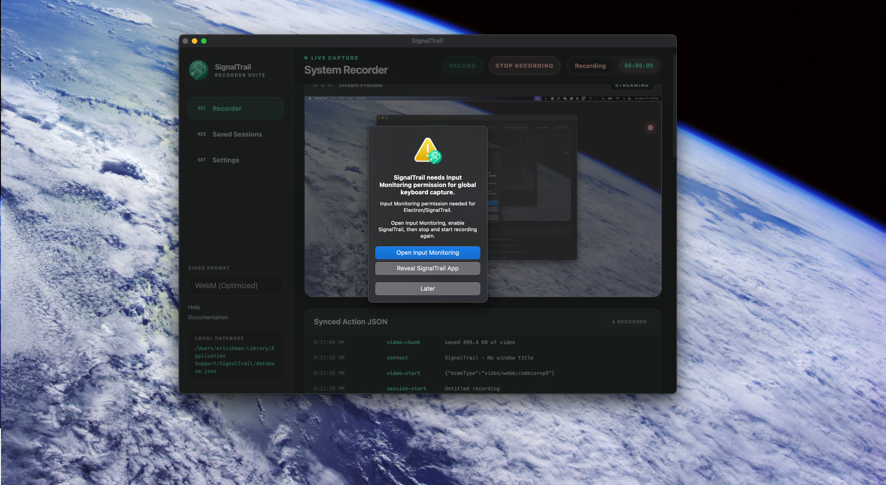

# SignalTrail

SignalTrail is a minimal Electron recorder app for collecting local computer-use traces:

- secure Electron defaults
- live screen preview
- WebM screen recording through browser `MediaRecorder`
- optional manual snapshot frames for thumbnails or review
- global cursor sampling plus in-app mouse/click telemetry
- global macOS keyboard event capture when Accessibility/Input Monitoring permissions allow it
- task and outcome labels for each recording
- active app, window title, and browser URL/title context when macOS permissions allow it
- append-only JSONL event storage per session
- organized `database.json` session index
- saved-session browser in the app
- no HTTP client dependencies
- optional macOS packaging command

## Preview




## Privacy And Recording Behavior

SignalTrail is open source and local-first. It does not include analytics, telemetry,
or network upload code, and it does not collect information in the background.

Recording only happens after you click **Record** or **Begin Recording** for a
session. When the session is stopped, SignalTrail stops writing session events,
video chunks, and screenshots.

Session data is stored locally on your machine under:

```text
~/Library/Application Support/SignalTrail/
```

Use the Settings page to open the local data folder, reveal the database, or
delete saved recording folders.

## macOS Setup Notes

When macOS asks for screen sharing, **Share Entire Screen** is preferred. This
gives SignalTrail the cleanest video/session capture across apps and windows.

For global keyboard capture, click **Open Input Monitoring** when SignalTrail
prompts you, then enable `SignalTrail` in macOS Input Monitoring. Stop and start
the recording again after granting permission.

## Run

```sh
npm install
npm start
```

The app writes session data under Electron's user data directory:

```text
~/Library/Application Support/SignalTrail/
```

The root contains:

- `database.json`: organized local session index
- `sessions/`: per-session recording folders

Each session folder contains:

- `events.jsonl`: newline-delimited event records
- `recording.webm`: screen recording when video is enabled
- `screenshots/`: optional PNG snapshots captured manually

`database.json` indexes task text, outcome labels, counts, latest screenshot, latest context, and file paths.

## Smoke Test

```sh
npm run smoke
```

The smoke test exercises the JSONL store without launching Electron.

## License

SignalTrail is available for personal, educational, research, evaluation, and
other non-commercial use. Commercial use requires prior written permission from
ReplayAI LLC. See `LICENSE` for details.

## Package For macOS

Install the optional packager when you are ready to build a distributable app:

```sh
npm install --save-dev @electron/packager
npm run package:mac
```

The packaged app is written to `dist/`.

## Event Shape

Each JSONL line is one object:

```json
{"ts":"2026-05-15T12:00:00.000Z","type":"mouse","payload":{"kind":"mousemove","x":320,"y":140}}
```

Screenshots are recorded as events that point to local PNG files:

```json
{"type":"screenshot","payload":{"file":"screenshots/screenshot-000001.png","width":1920,"height":1080}}
```

Context changes are recorded when the frontmost app/window changes:

```json
{"type":"context","payload":{"app":{"name":"Google Chrome","bundleId":"com.google.Chrome"},"window":{"title":"Gmail - Inbox"},"browser":{"title":"Gmail","url":"https://mail.google.com/"}}}
```

This keeps the trace easy to stream, replay, label, or upload later.

Video chunks are appended to `recording.webm` and indexed in `database.json`:

```json
{"type":"video-chunk","payload":{"bytes":524288,"chunkIndex":4,"mimeType":"video/webm;codecs=vp9"}}
```

On macOS:

- Grant Screen Recording permission when prompted so the live preview and screenshots can capture the display.
- Grant Automation permission for Electron/SignalTrail to read frontmost app and window metadata.
- Grant browser automation permission if you want URL/title capture for Chrome, Edge, Brave, or Safari.
- Click **Open Input Monitoring** and enable SignalTrail if you want keyboard events from other apps captured.
